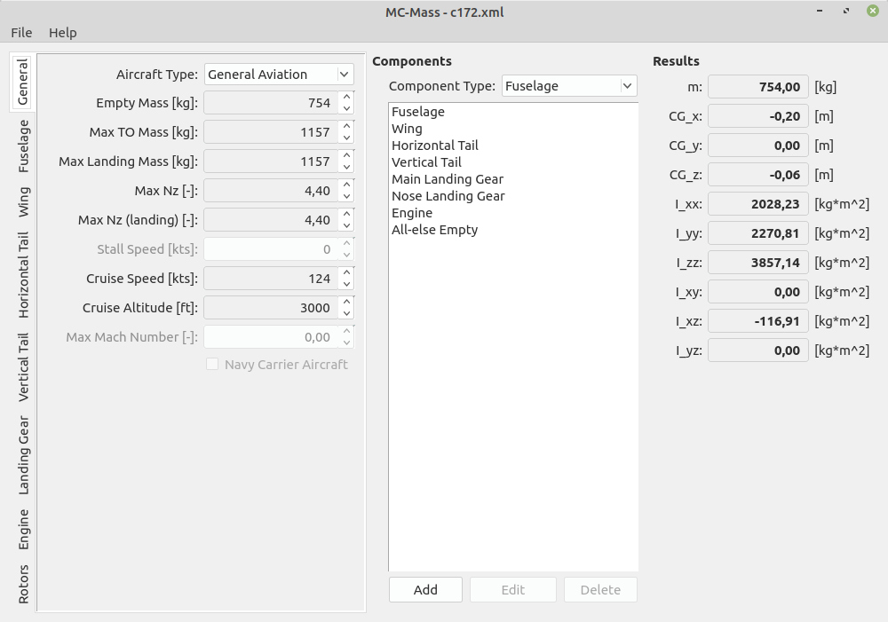

# mscsim-mass
Aircraft mass characteristics (empty mass, center of mass and inertia tensor) estimation tool, which uses formulas from [Raymer D.P. Aircraft Design: A Conceptual Approach](http://doi.org/10.2514/4.104909) and [NASA TP-2015-218751](https://ntrs.nasa.gov/citations/20150021267).

