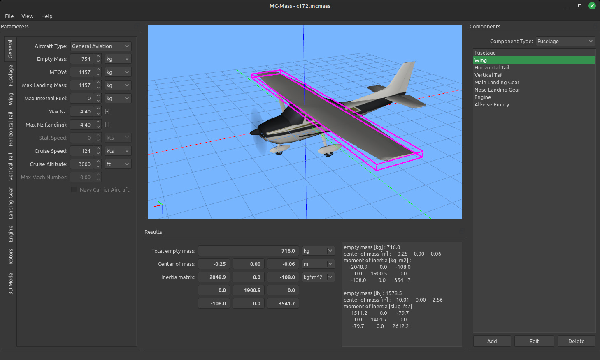

# MC-Mass

Aircraft mass characteristics (empty mass, center of mass and inertia tensor) estimation tool, which uses formulas from [Raymer D.P. Aircraft Design: A Conceptual Approach](http://doi.org/10.2514/4.104909) and [NASA TP-2015-218751](https://ntrs.nasa.gov/citations/20150021267).

## Documentation

Documentation is available [here](https://github.com/marek-cel/mc-mass/docs/mc-mass.pdf).

## Installation

### Linux

Linux [dpkg package](https://github.com/marek-cel/mc-mass/releases/download/1.0/mc-mass_1.0_focal_amd64.deb) is provided for Ubuntu 22.04 LTS.

### Windows

Windows [zip package](https://github.com/marek-cel/mc-mass/releases/download/1.0/mc-mass_1.0_win64.zip) is provided. It does not require installation.

## Building from source

### Dependencies

MC-Mass requires Qt and libmcutil.

* [Qt5](https://www.qt.io/)
* [OpenSceneGraph](https://www.openscenegraph.com/)
* [GoogleTest](https://github.com/google/googletest)
* [units](https://github.com/nholthaus/units)

#### Linux

On Ubuntu based Linux distributions Qt, OpenSceneGraph amd GoogleTest can be installed with the following command:

```apt install libqt5svg5-dev qtbase5-dev libopenscenegraph-dev libgmock-dev libgtest-dev```

#### Windows

On Windows those dependencies have to be installed manually.

### Building using qmake

MC-Mass can be built with ```qmake``` tool. Run qmake on ```mc-mass.pro``` file and then use appropriate building system. You can also use Qt Creator.


